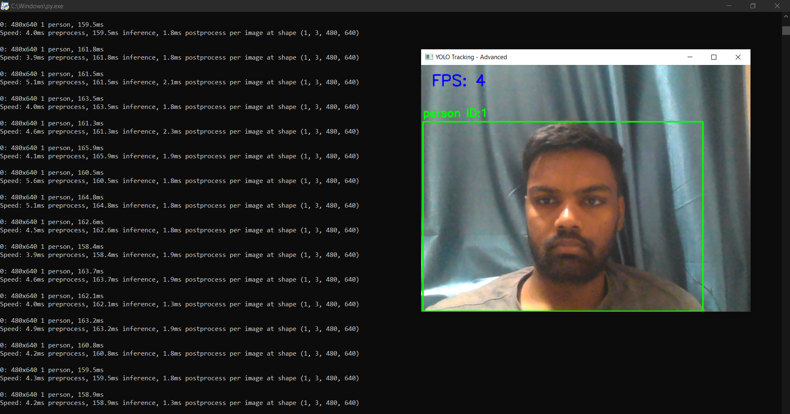
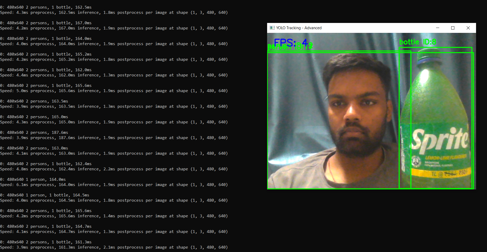

# 🎯 YOLO Object Detection Project

## 📌 Overview

This project implements **real-time object detection** using the YOLO (You Only Look Once) algorithm.
It detects and classifies objects from images or video streams with high speed and accuracy.

---

## 🎯 Objective

* To perform real-time object detection
* To identify multiple objects in a single frame
* To demonstrate the power of deep learning in computer vision

---

## 🧠 Technologies Used

* Python
* OpenCV
* YOLO (You Only Look Once)
* Deep Learning

---

## ⚙️ Working Principle

1. Input image or video is captured
2. YOLO model processes the frame in a single pass
3. Objects are detected with bounding boxes
4. Each object is classified with a label and confidence score
5. Output is displayed in real time

---

## 🖼️ Output Screenshots

### 🔹 Detection Result 1



### 🔹 Detection Result 2



---

## 🚀 Features

* Real-time object detection
* High speed and efficiency
* Multiple object detection in one frame
* Accurate bounding boxes and labels

---

## 📂 Project Structure

* `README.md` → Documentation
* `sample1.png` → Detection output 1
* `sample2.png` → Detection output 2
* `main.py` → Main execution file

---

## ▶️ How to Run

1. Clone this repository
2. Open the project in VS Code
3. Install required libraries:

   ```bash
   pip install opencv-python numpy
   ```
4. Run the program:

   ```bash
   python main.py
   ```

---

## 📈 Future Scope

* Integrate with real-time surveillance systems
* Deploy on embedded systems (Raspberry Pi, Jetson Nano)
* Improve accuracy using custom-trained datasets

---

## 👤 Author

**Anmol Rai**
Robotics & Automation Engineering Student
